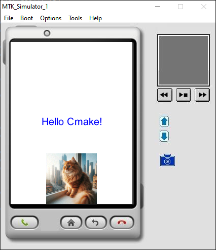

# Port and demo of [LVGL](https://github.com/lvgl/lvgl) for MRE platform



# How to compile, run, edit...

It based on [CmakeMreTemplate](https://github.com/XimikBoda/CmakeMreTemplate) and in [README.md](https://github.com/XimikBoda/CmakeMreTemplate/blob/main/README.md) you can find information about this.

# How to clone 

### Clone with full lvgl history (+-480 MB)
```
git clone --recursive https://github.com/XimikBoda/lvglMreDemo.git
```

### Clone without lvgl history (+-200 MB)
```
git clone https://github.com/XimikBoda/lvglMreDemo.git
cd lvglMreDemo
git submodule init
git submodule update --depth 1
```

## What are the main projects in this repo about?

|Folder|Description|
|-|-|
|main|Main code for lvgl app (now it run `lv_demo_music`).|
|lvgl|lvgl repository, connected as git submodule.|
|lv_port_mre|Driver for lvgl to access Mre Api. Implementation: graphics, input (touchscreen and keyboard) and file system.|
|cmake, mreapi, resourses, core, vxp, run|See [README.md](https://github.com/XimikBoda/CmakeMreTemplate/blob/main/README.md).|
